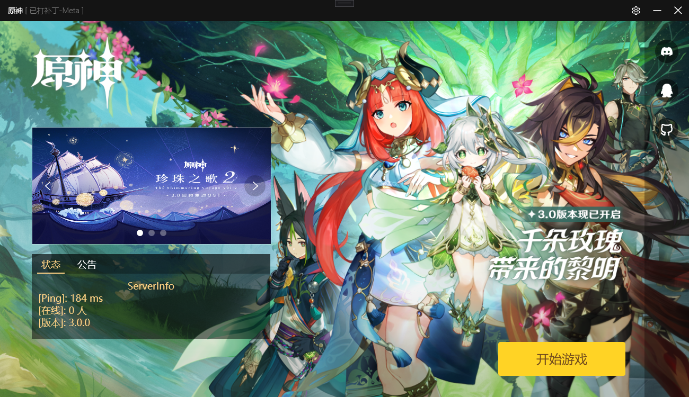
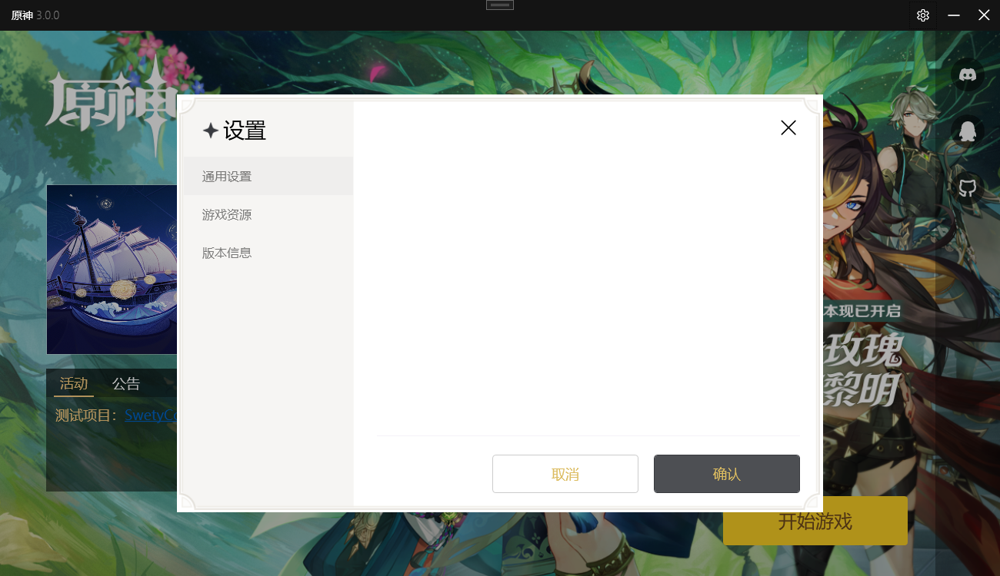

# GenshinLauncherUI
> 原神启动器  
请注意：~~再使用修补功能前请确定metadata目录仅有一个文件且为官方文件
如果修补时候metadata目录残留其他版本的文件将导致备份/恢复功能出现问题从而损坏你的游戏文件~~
如果你不修改pkg_version文件那么理论上来说它不会损坏游戏文件

## ✨功能 (持续完善ing)

✅ 高仿官方启动器UI  
✅ 显示补丁状态  
✅ 自带代理  
✅ 自定义部分页面资源  
✅ 直接修补metadata文件  
⛔️ 直接修补userassemby文件  
✅ 服务器状态  
⛔️ 自定义公告（暂未找到支持公告api的服务端） 

## 🖼️效果



## 🎁使用
> + 当启动器检测到当前补丁状态为未打补丁时会拒绝启动代理
> + 当打补丁时如果初始文件md5和官方对不上会拒绝打补丁
1. 前往 Release 寻找操作系统对应的压缩包
2. 解压到任意目录
3. 双击exe

## 🐛常见问题
+ 打不开应用程序:
	```
	You must install .NET Desktop Runtime to run this application.
	Architecture: x64
	App host version: 6.0.7
	Would you like to download it now?
	Learn about runtime installation:
	https://aka.ms/dotnet/app-launch-failed
	```
	前往 [https://dotnet.microsoft.com/zh-cn/download/dotnet/6.0](https://dotnet.microsoft.com/zh-cn/download/dotnet/thank-you/runtime-desktop-6.0.8-windows-x64-installer)下载运行环境
+ 其他  
	前往 [issues](https://github.com/gc-toolkit/GenshinLauncher/issues)具体描述你遇到的问题

## 🙇‍感谢
+ [Grasscutters/Cultivation](https://github.com/Grasscutters/Cultivation)
+ [Bambi5/Collei_Launcher](https://github.com/Bambi5/Collei_Launcher)
